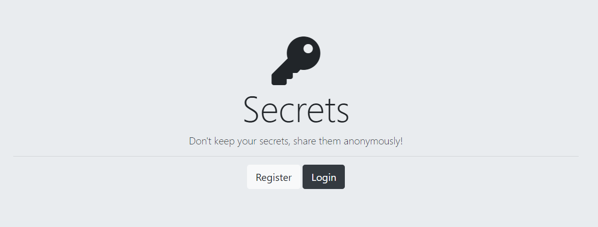
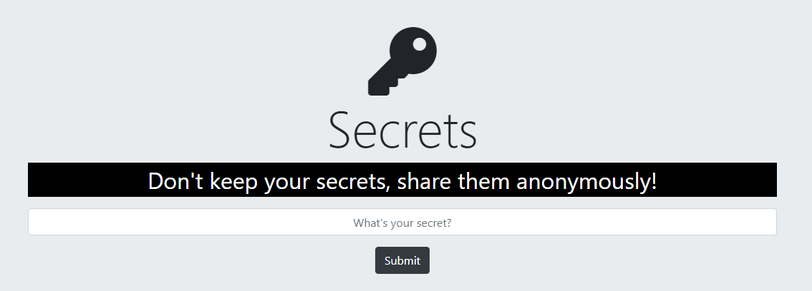
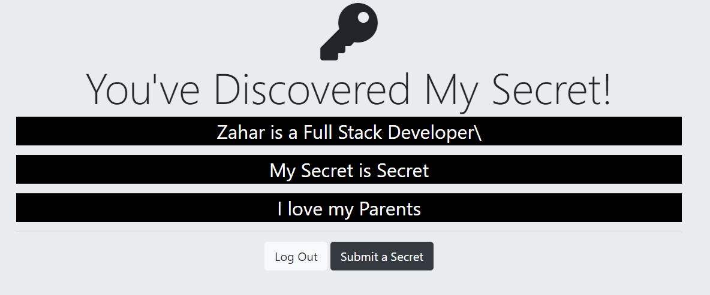

# Secrets

<h3>Visit the Site</h3> https://zahar-secret.herokuapp.com/

<h3>Information </h3> Project consists of google Authentication + passport + MongoDB

<h3>Features </h3> This Project is designed to Store your Secret Information extensive work on google authentication using passport + Mongodb for Storing data at the backend 

<h3>Tech Stack </h3>  

1) NodeJS 2) Express 3) Google Authentication 4) Passport 5) mongoose 6)mongoDB 

  

